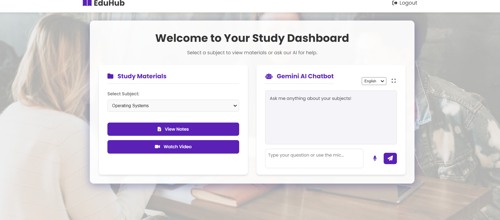

AI Student Portal 🎓🤖

EduHub is a smart student portal that allows students to access notes and videos for different subjects, and also features a Gemini-powered AI chatbot to answer academic doubts in multiple languages.

---

## 🚀 Features

- 🔐 **User Registration & Login**
- 📚 **Study Materials Access** – Notes & Videos
- 🤖 **Gemini AI Chatbot** with:
  - 📥 Text and 🎤 Voice input
  - 🌐 Multilingual support (English, Hindi, Spanish, French, German)
- 📧 **Email Suggestion Feature** (via Brevo SMTP)
- 🎨 Responsive UI using EJS + CSS

---

## 🛠 Tech Stack

| Layer           | Technology                          |
|----------------|--------------------------------------|
| Frontend       | EJS, CSS, HTML                       |
| Backend        | Node.js, Express.js                  |
| Database       | MySQL                                |
| Authentication | bcryptjs, express-session            |
| AI Integration | Gemini API (Google Generative AI)    |
| Email Service  | Nodemailer + Brevo SMTP              |
| Config/Secrets | dotenv for managing API keys         |

---

## 📷 Screenshots

> Replace these placeholders with your real screenshots

- 📌 **Login Page**

  

- 📌 **Dashboard + Study Materials**

  

---

## 🎬 Demo Video

> Upload your demo video to YouTube or your repo and paste the link here.

📺 [Watch Full Demo on YouTube](video(1)(1).mp4)

Or embed directly:

allowfullscreen></iframe>
🔐 Environment Setup
Create a .env file:

env
Copy
Edit
GEMINI_API_KEY=your_google_genai_key
BREVO_API_KEY=your_brevo_smtp_key
🧪 Installation Steps
bash
Copy
Edit
git clone https://github.com/your-username/AI-Student-Portal.git
cd EduHub-AI-Student-Portal
npm install
📦 MySQL Setup
sql
Copy
Edit
CREATE DATABASE student_portal;

USE student_portal;

CREATE TABLE users (
  id INT AUTO_INCREMENT PRIMARY KEY,
  name VARCHAR(100),
  email VARCHAR(100),
  password VARCHAR(255)
);

CREATE TABLE subjects (
  id INT AUTO_INCREMENT PRIMARY KEY,
  title VARCHAR(100),
  notes_url TEXT,
  video_url TEXT
);
▶️ Run the App
bash
Copy
Edit
node index.js
Visit: http://localhost:3000

📬 Suggestion Feature
Suggestions submitted by students via chatbot can be sent to your email through Brevo SMTP configuration.

🌟 Future Plans
Admin panel for adding materials

Chatbot memory and user history

Reminder & notification system

Live doubt-solving with experts

📄 License
This project is licensed under the ISC License.

🤝 Contributing
Feel free to fork and contribute! Please open a pull request for any improvements.

yaml
Copy
Edit

---

Let me know if you want:

- A custom `.env.example` file  
- `schema.sql` dump for easier DB setup  
- Badges (e.g., license, tech used, version)  
- Markdown badges for YouTube + Screenshots section  

Just say the words!
